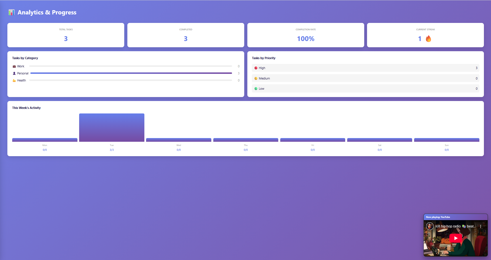
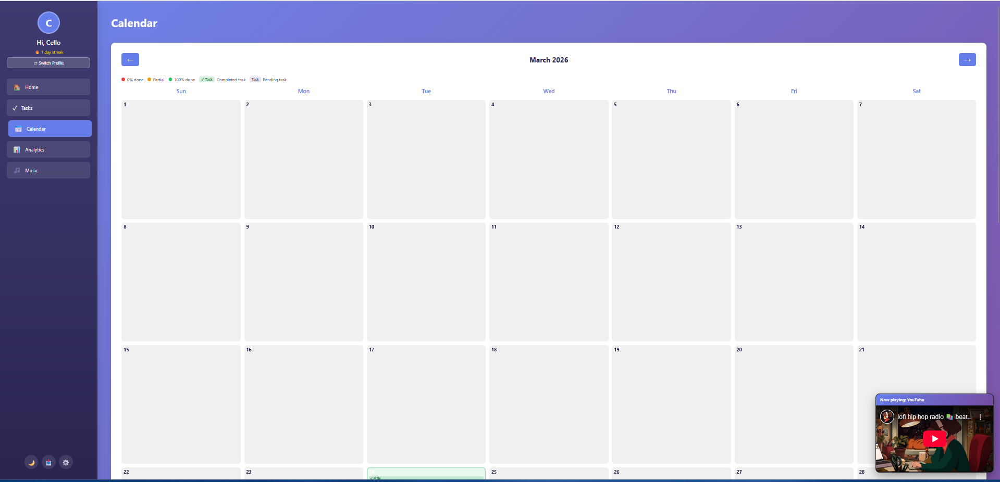
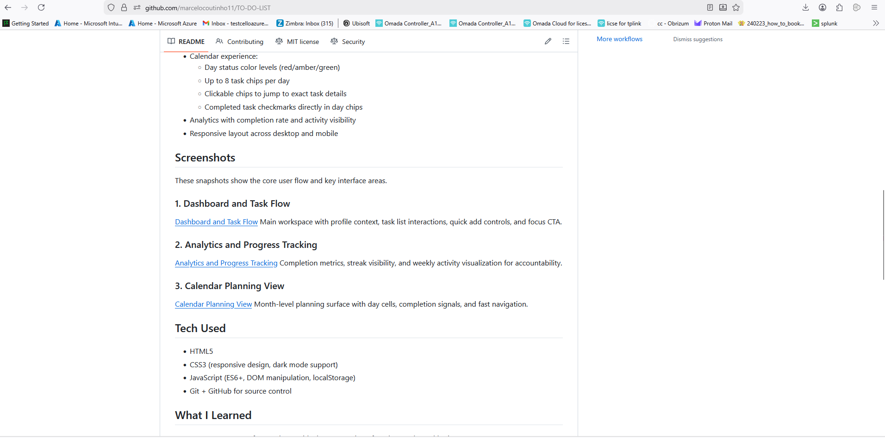

# TO-DO APP

A portfolio-ready productivity app built with vanilla HTML, CSS, and JavaScript.

## What I Built
Built a multi-profile task management web app focused on execution speed, mobile usability, and progress visibility.

Core capabilities:
- Profile-specific task spaces (up to 5 users)
- Daily task tracking with categories, priorities, and due dates
- Calendar day chips with completion status and task previews
- Analytics dashboard for completion trends and streak tracking
- Mobile-first navigation (hamburger menu + responsive behavior)
- Built-in focus music presets (YouTube Lo-fi, YouTube Chill Gang, SoundCloud, 5FM)

## Features
- Multi-profile local persistence with isolated task data
- Fast task workflow: create, complete, delete, and filter
- Calendar experience:
   - Day status color levels (red/amber/green)
   - Up to 8 task chips per day
   - Clickable chips to jump to exact task details
   - Completed task checkmarks directly in day chips
- Analytics with completion rate and activity visibility
- Responsive layout across desktop and mobile

## Screenshots
These snapshots show the core user flow and key interface areas.

### 1. Dashboard and Task Flow

Main workspace with profile context, task list interactions, quick add controls, and focus CTA.

### 2. Analytics and Progress Tracking

Completion metrics, streak visibility, and weekly activity visualization for accountability.

### 3. Calendar Planning View

Month-level planning surface with day cells, completion signals, and fast navigation.

## Tech Used
- HTML5
- CSS3 (responsive design, dark mode support)
- JavaScript (ES6+, DOM manipulation, localStorage)
- Git + GitHub for source control

## What I Learned
- How to structure a frontend app with clear separation of markup, style, and logic
- How to build responsive/mobile-first UI behavior and debug CSS overrides
- How to model per-profile data in localStorage safely and predictably
- How to evolve feature sets iteratively with clean commits and documentation
- How to publish and maintain a portfolio project with GitHub

## Project Structure
- `public/index.html` - UI structure and pages
- `public/styles.css` - styles, responsiveness, and component states
- `src/scripts.js` - app logic for tasks, profiles, calendar, analytics, and music
- `LEARNING_NOTES.md` - growth log and engineering reflection
- `GITHUB_DEPLOY_PLAYBOOK.md` - beginner-friendly deployment steps

## Run Locally
### Option A: VS Code Live Server (recommended)
1. Open this folder in VS Code.
2. Open `public/index.html`.
3. Right-click and choose **Open with Live Server**.

### Option B: Any static server
This app works as static files (no required backend for core features).

## Data Storage Notes
- Uses browser localStorage.
- Profile data is isolated per profile ID.
- Data stays on the same browser/device unless storage is cleared.

## Security Notes
- No secrets should be committed to this repository.
- This is a frontend/localStorage app (not production authentication).
- For stronger security, move profiles/auth and data to a backend service.

## Growth Log
See `LEARNING_NOTES.md` for ongoing engineering progress and lessons learned.

## License
This project is licensed under the MIT License. See `LICENSE`.
